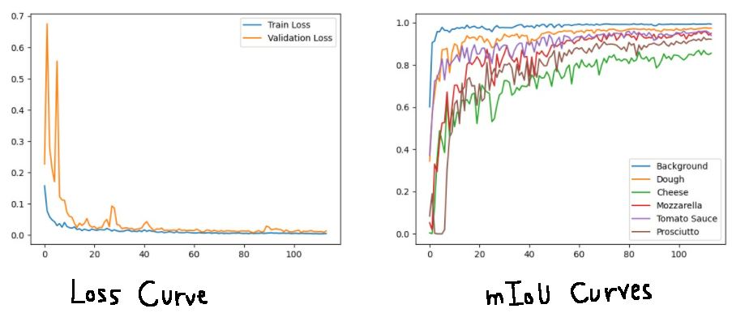
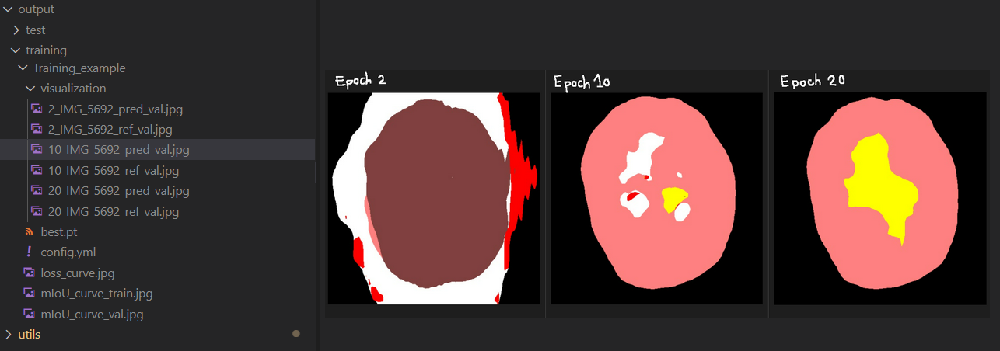
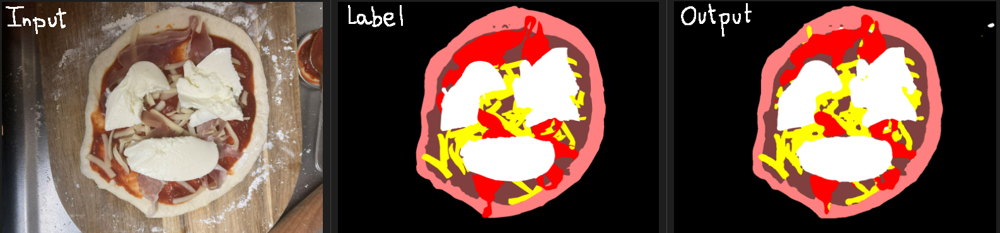

# Semantic segmentation

Semantic segmentation


## Prepare your data

Note. Loader expects .jpg, .JPG or .png for the images, .png for the labels.

### (Optional) Make patches ###
Depending on your data, you may want to create patches out of your images.
e.g. If you have huge images (satellite images etc)

Please set config crop mode as "crop" in config["preprocessing"]["mode"] as well as paths in config["paths"]["preprocessing"]["make_patches"]

```
python data_preprocessing/create_fuse_patches.py config_files/multiclass/config.yml
```

## Training the model

### Step 1. Fill out the config file ###

### Step 2. Train model ###

Please fill out config file with data paths and training parameters

```
python train.py config_files/multiclass/config.yml
```

### Step 3. Test model ###
```
python test.py config_files/multiclass/config.yml
```
Note. fp16 available for small gain of inference speed

## Folder organization example ##

Example of how to organize the files for the scripts to work

```
.
├── config_files
│   ├── binary_segmentation
│   │    └── config.py
│   └── multiclass_segmentation
│        └── config.py
├── data 
│   ├── train 
│   │       ├── img
│   │       │     ├── IMG_5686.JPG
│   │       │     └──...
│   │       └── label
│   │             ├── IMG_5686.png
│   │             └──...
│   ├── valid
│   └── test
├── utils
├── CONFIG.py
├── loader.py 
├── test.py 
├── train.py 
└── README.md (this file)
```

## Example on toy dataset ##
### Toy dataset - Pizza topping ###
We made a toy dataset of 49 images of homemade pizza with various toppings. 

The classes considered are : 
- Background 
- Dough
- Cheese
- Mozzarella
- Tomato Sauce
- Prosciutto

Please contact me if you want the dataset and annotation !

### Training ###

Features to support training / inference include : 

- Loss curve (train, validation)
- mIoU curves (train, validation)



- Inference images on few samples (train, validation)
- Copy of config.yml used for reproducibility



### Example of results ###
Example of inference :



## TO DO ##
- [ ] Util - Get stats about the dataset
- [ ] Feature - Oversampling by writing path
- [ ] Feature - Save datasplit for reproducibility

